Terraform & AWS CLI Installation

Install Terraform CLI : https://developer.hashicorp.com/terraform/install

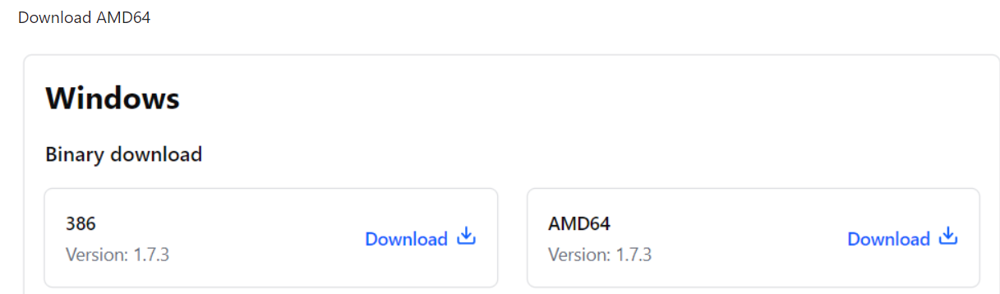

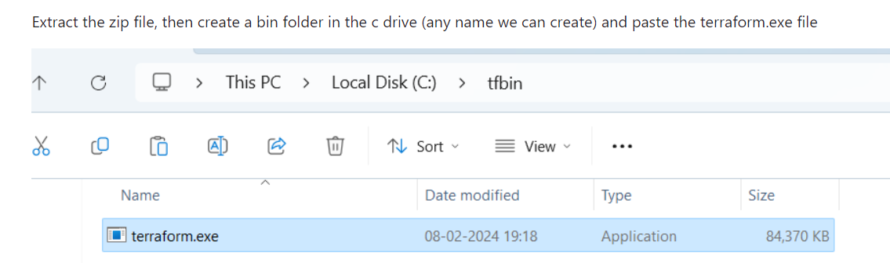

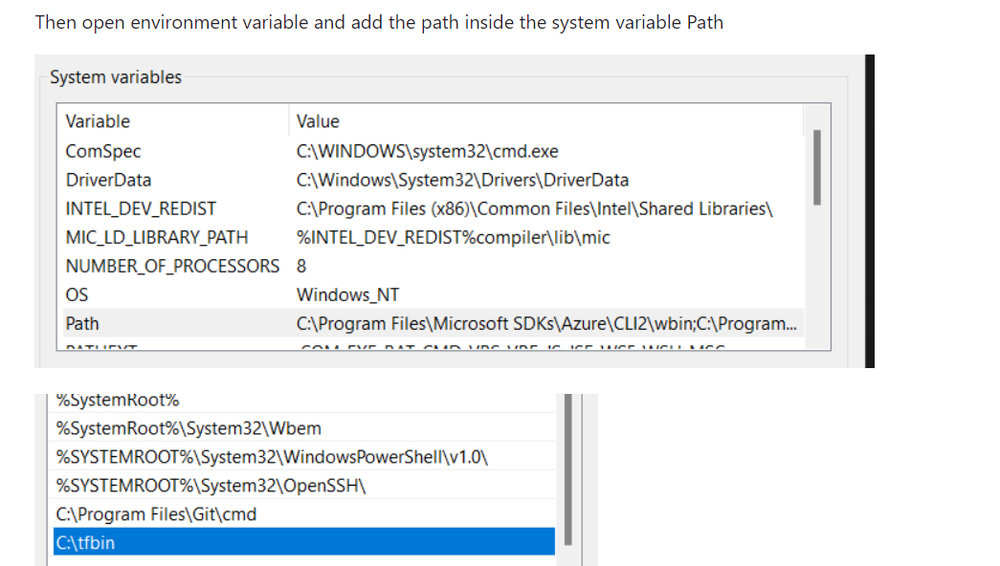

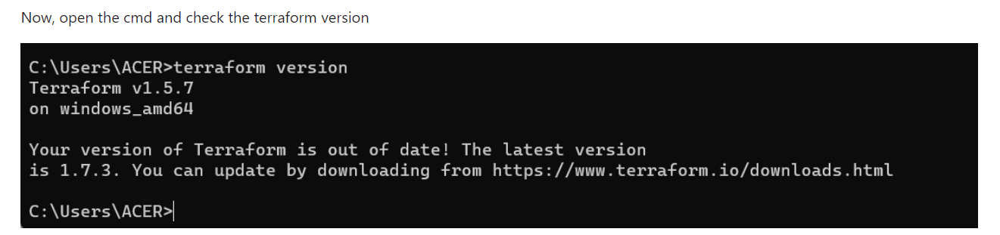

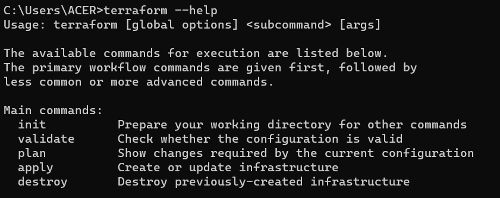

Install AWS CLI : https://docs.aws.amazon.com/cli/latest/userguide/getting-started-install.html

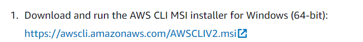

It will download a .msi file, Then install it

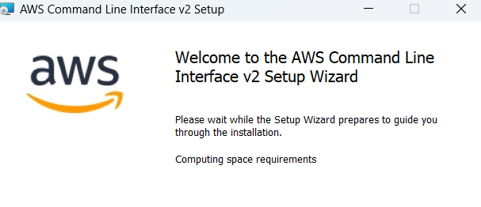

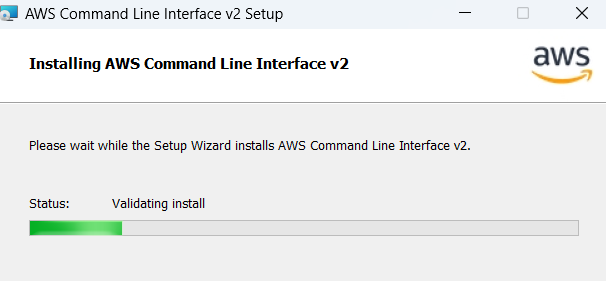

Now check the aws version,
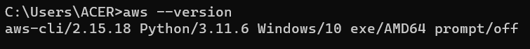

Create AN AWS IAM USer and get the access and secret key, After that run aws configure command from cmd

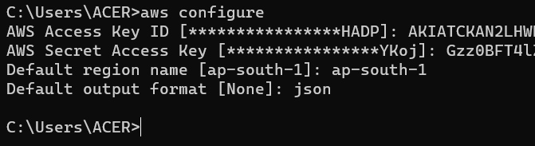

Lets verify aws command is working or not

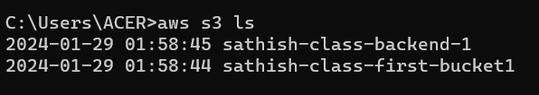

So it is working fine.

Create AWS Profile 

Go to C drive, then go to the user , shoose the user which is being used for the installations, For my case the user name is ACER

Here create a directory named .aws (or by default it will be there when we configure aws)

Under .aws there will be a file name credentials

Like this 

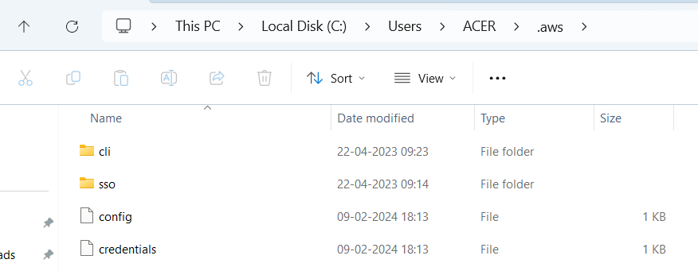

Profile name is default in our case 

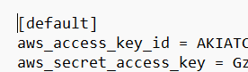

