Terraform Block

We can call this block as 3 different names, Terraform Block OR Terraform Settings Block OR Terraform Configuration Block

It is a special block used to configure some behaviors

1. Required Terraform Version
Which terraform version we need
2. List Required Providers
Which Provider we need and which version
3. Terraform Backend
Which backend We need to configure for storing some terraform files

Note : Terraform 0.12 or Earler Terraform Block was not there
BUT, Terraform 0.13 or later we have the terraform block

================= Terraform 0.12 or Earlier =================
#Configure The AWS Provider

provider "aws" {
    version = "~> 3.0"
    region = "ap-south-1"
}

================= Terraform 0.13 or Later =================
#Configure The AWS Provider

terraform {
    #required Terraform Version (Which terraform Version we need)
    required_version = "~> 0.14.3"

    required_providers {
        aws = {
            source = "hashicorp/aws"
            version = "~> 3.0" # Optional but recommended
        }
        }
    # Remote Backend (Every Terraform Project has its state/ configuration information and we need to store those in Remote Backend)

    backend = "s3" {
        bucket = "testbucket"
        key = "path/to/my/key"
        region = "ap-south-1"
    }

    }

=========================================
Provider Block

provider "aws" {
    region = "ap-south-1"
}

It is the Heart of Terraform
Terraform relies on provider block to interact with the Remote systems (Cloud)
We declare providers block in Terraform to install providers and use them
Provider configurations belong to Root Module (In terraform we are having 2 types of module, Root module and Child Module)

Resource Block

Earch resource block describes one or more infrastructure Objects

Resource Syntax : Which Service has which syntax

========================
1. terraform init

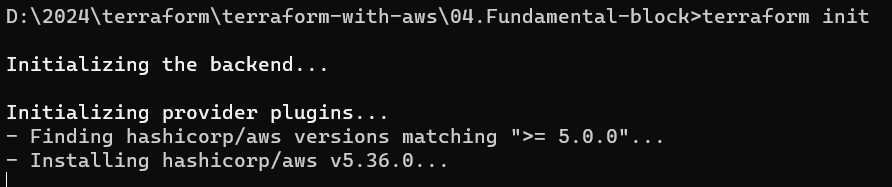

2. terraform validate

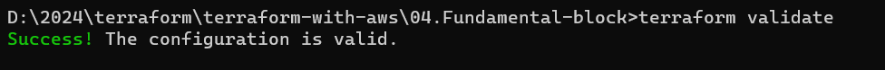

3. terraform plan

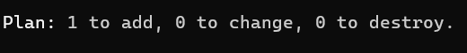

4. terraform apply

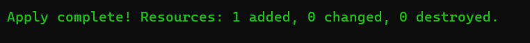

In the AWS Console we can see the AWS EC2 is created

Lets Copy the Public IP of the EC2 machine

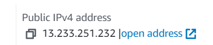

try IP/index.html
It is not openning
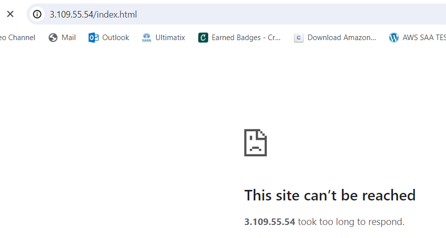

Now open the http protocol from the SG

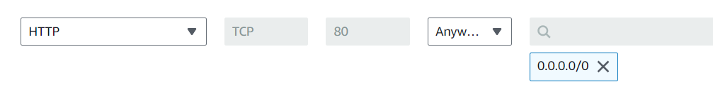

Now open

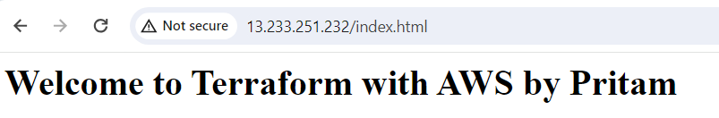

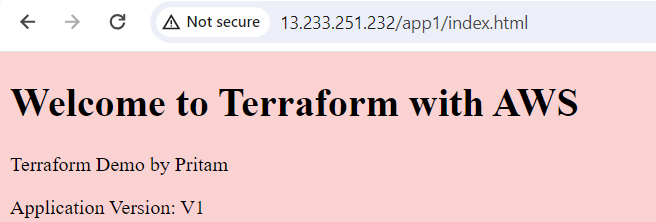

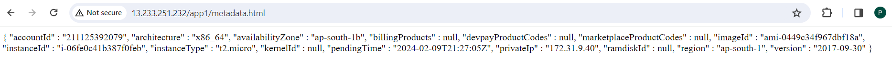

5. terraform plan -destroy ( will give the destroy plan)

6. terraform destroy

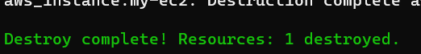

Terraform TF State

Resource Behaviour:

1) Create Resource
2) Destroy Resource
3) Update In-Place Resources
4) Destriy and Re Create Resources

In every Behaviour, it is related to Terraform State

Whenever we are running the Terraform Apply Command, we successfully create the Terraform infra

Whenever for the First time we run terraform apply and our infra gets created then the terraform.tfstate file gets created in our Local Working Directory

Current State :

what is there in real time in the AWS which is created by Terraform code , is being stored into the terraform.tfstate file. 

Desire State :

Which we write in TF configurations files and which we wants to create in AWS Cloud

