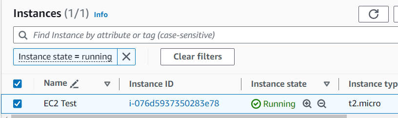

In this we are going to understand some terraform concepts.

1) Terraform Input Variables
2) Terraform Output Values
3) Terraform Datasources

In this demo we are going to fetch the AWS AMI id dynamically using terraform datasources and create AWS EC2 instance.
We are also associate an AWS Key pair with the EC2 instance which is present in our EC2 dashboard.
We are also going to create 2 Security group resources, one is for allowing for SSH and another is for web.
Using SSH we will login to the Terminal of the EC2 instance and using the web we will access the web server (APACHE).

We can add both SG in a single SG but to demonstrate the list items we will create 2 SGs

First , Create an EC2 Key Pair

Terraform Variables.

1) Input Variables
2) output Values
3) Local Values

Input Variables.

There are 10 different ways by which we can pass the Input Variables

1) With Input Variables Basic
2) when we run terraform plan or terraform apply we can pass the input variables
3) from the command line we can pass the input variables via -var CLI argument / override default input with CLI var
4) By defining the environment variable like TF_var_name (name is the input variable)
5) Using terraform.tfvars files
6) from the CLI we can pass by -var-file we can pass the input variable
7) with auto.tfvars we can pass the input variables
8) We can pass List or MAP in input variables
9) We can pass custom Validation Rules in variables
10) Protect sensetive data from the Input Variables

1) With Input Variables Basic

A) Now lets create the provider.tf 
Here we have mentioned the terraform version and the provider version

B) Then create the var.tf file

C) After that create the sg.tf where we are going to define the EC2 SG

D) Now lets create ami-datasource.tf which will fetch the latest AMI ID from AWS for AMAZON LINUX2 OS

Datasources:

1) It allows data to be fetched or computed for use in Terraform Configuration
2) Datasources will help to fetch the data by outside information (Example: We are searching for the AMI file name which is present in AWS not in terraform, so The name we are giving is from outside of terraform) and From another terraform configuration file (Example we need to get 1 project information from another project then we can use the datasource concept, Will see this example later)

datasource will start with data block, And whatever we need to create a Resource will be present in the data block

Example : data "aws_ami" "my-ami" {}

When we will call this AMI ID OR when we need the ami id in our EC2 resource then we can pass as

ami = data.aws_ami.my-ami.id 

data - represent datasource
aws_ami - represents the resource Name
my-ami -represents the local name of the resource
.id - represents the id of the AMI 

Documntation : https://registry.terraform.io/providers/hashicorp/aws/latest/docs/data-sources/ami
owners - (Optional) List of AMI owners to limit search
most_recent - (Optional) If more than one result is returned, use the most recent AMI.

Fiter by AMI Name, 

How to get the AMI Names ?

Get the AMI ID from launch instance

This is the AMI name, Now in the datasource block put the name like this :

filter {
    name   = "name"
    values = ["al2023-ami-*-kernel-6.1-x86_64"]
  }

E) test.sh (SHELL script for the web application)
F) main.tf 
G) Now, create the outfut.tf file

Output values are nothing but the return value of a Terraform module and it has several uses

1) A root module can use outputs to print certain values in the CLI output after running terraform apply
2) A child module can use the outputs.

terraform init

terraform validate

terraform plan

Here we can see 3 resources are going to create

First is the EC2,

 

Here we can see it picked the ami-id from the datasource file

Second is the first SG

Third the another SG

terraform apply --auto-approve

Here, 3 resources are created and also it output the values

Lets Validate,

Now, terraform destroy

Validate

