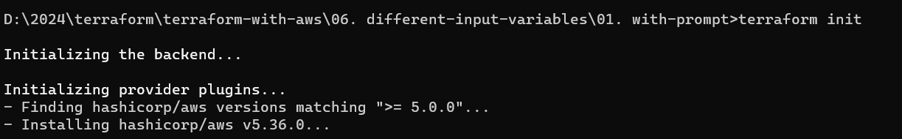
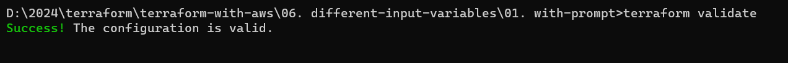
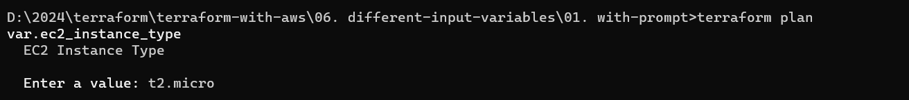
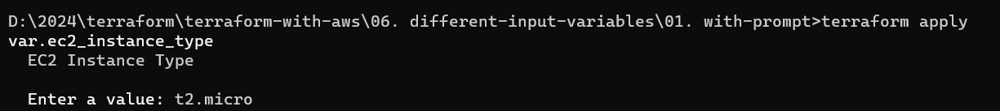
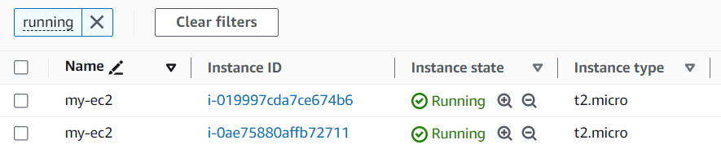
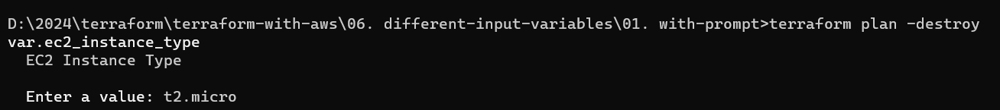
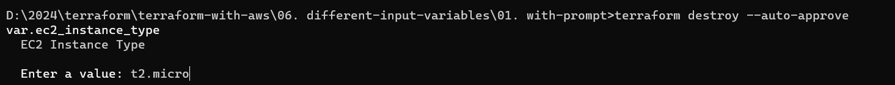
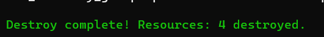
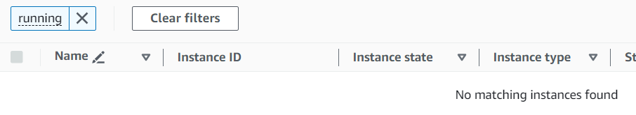

terraform init

terraform validate

terraform plan 

when we will run it it will prompted for the instance type

terraform apply 

it will ask for input again

Validate

terraform plan -destroy

terraform destroy --auto-approve

