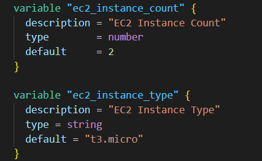
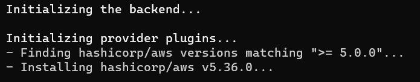
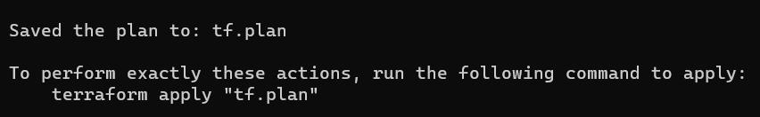
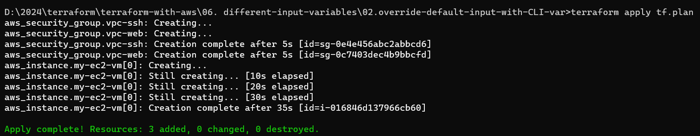
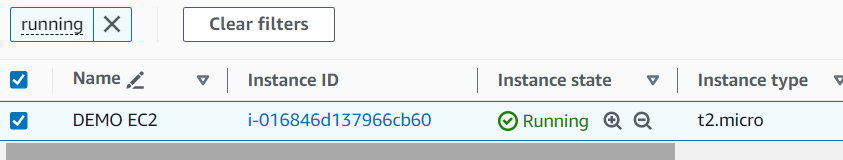
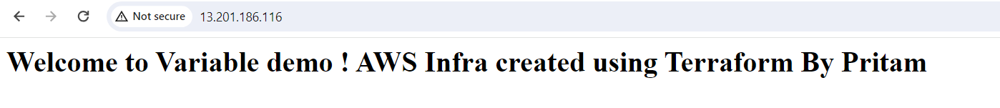

Override the default variable value with -var flag in CLI

These are the default variable in the terraform configuration file

terraform init

terraform plan -var="ec2_instance_type=t2.micro" -var="ec2_instance_count=1"

Here we can see 3 Resources are going to be created 1 EC2 and 2 SGs

terraform plan -var="ec2_instance_type=t2.micro" -var="ec2_instance_count=3"

Here we can see 3 Resources are going to be created 3 EC2 and 2 SGs

If we want to save the plan in a file then we need to use -out flag with the file name

terraform plan -var="ec2_instance_type=t2.micro" -var="ec2_instance_count=1" -out tf.plan

Plan is saved in the file

Now we can run the terraform apply command with the output file like this

terraform apply tf.plan

Whenever we apply with the plan file name, it will not ask for the confirmation, it will create the resources directly

terraform destroy

