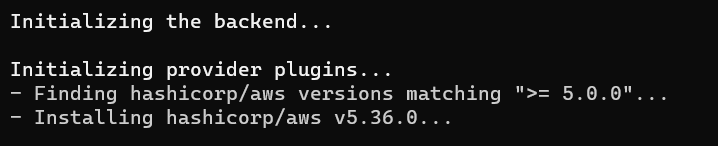

Override the TF Default Variable by Terraform ENV Variables.

These are the default values in the Terraform Configuration File

Now, lets change these values by Exporting Terraform Environment Variables

Do it in git bash

export TF_VAR_ec2_instance_type=t2.micro
export TF_VAR_ec2_instance_count=3

terraform init

terraform plan

terraform apply --auto-approve

terraform destroy --auto-approve

