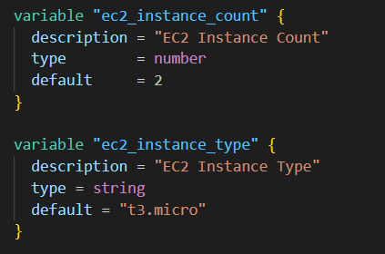
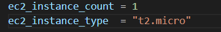
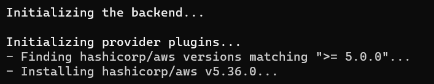
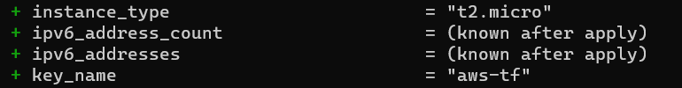
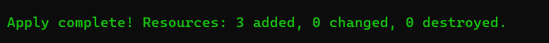
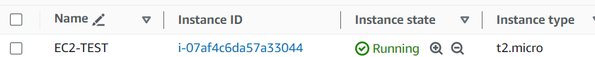
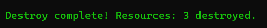
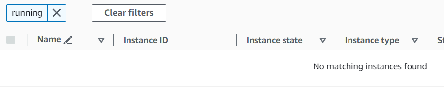

terraform.tfvars

Terraform will auto load the variables present in terraform.tfvars file by overriding the default values in variable.tf file

We do not have to pass the terraform.tfvars file name when we are running terraform plan or terraform apply commands

This is our variable.tf file

In the terraform.tfvars these are the input variables

terraform init

terraform plan 

Here we can see the default variable value is being overridden by terraform.tfvar file

terraform apply --auto-approve

So, it is confirmed that the default variable can override by terraform.tfvar file

Now, destroy

terraform destroy --auto-approve

