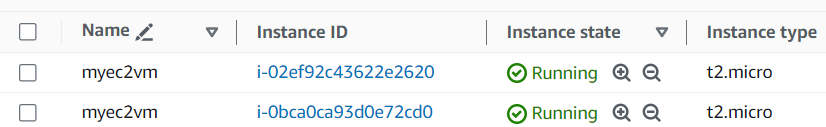

.tfvars files other than terraform.tfvars file

Terraform will auto load the variables present in terraform.tfvars file by overriding the default values in variable.tf file.

In case of terraform.tfvars
We do not have to pass the terraform.tfvars file name when we are running terraform plan or terraform apply commands

In case of other .tfvars files
But if we have other .tfvars file then we need to explicitly provide that file name with -var-file argument in terraform plan and terraform apply command.

Note : 

The variable which is present in terrafor,.tf vars will apply automatically when we will do terraform plan or terraform apply. 

When we will deploy infra in dev environment we will pass dev.tfvars file with -var-file argument along with terraform plan or terraform apply command

When we will deploy infra in prod environment we will pass prod.tfvars file with -var-file argument along with terraform plan or terraform apply command

In this demo we have this variable in terraform.tfvars file

ec2_instance_count = 2

And we have this in dev.tfavrs file: ec2_instance_type  = "t2.micro"

in prod.tfvars file : ec2_instance_type  = "t2.nano"

terraform init 

terraform validate

Now, 

If in our terraform.tfvars file the variables are like this :

ec2_instance_count = 2
ec2_instance_type  = "t3.micro"

And in the dev.tfvars file the variables are like this :

ec2_instance_type  = "t2.micro"

When we will run the terraform plan command it will pick the data from terraform.tfvars file

Lets Validate :

terraform plan

But if we need the variable from dev.tfvars file we need to pass the name of the file by

terraform plan -var-file f5-dev.tfvars

terraform apply -var-file f5-dev.tfvars

