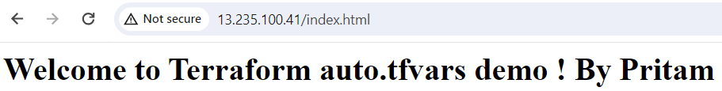

Here we will create a file name with the extention .auto.tfvars

Whatever variable values present in this file will be auto loaded during the teraform plan or terraform apply 

This are the variable in variable.tfvars

variable "ec2_instance_count" {
  description = "EC2 Instance Count"
  type        = number
  default     = 2
}

variable "ec2_instance_type" {
  description = "EC2 Instance Type"
  type = string
  default = "t3.micro"
}

This is the variable present in terraform.tfvars file

ec2_instance_count = 1

And this is the variable mentioned in the .auto.tfvars file

ec2_instance_type  = "t2.micro"
ec2_instance_count = 3

Now, 

terraform init 

terraform validate 

Now terraform plan

now , terraform apply --auto-approve

terraform destro --auto-approve

