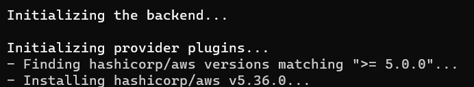
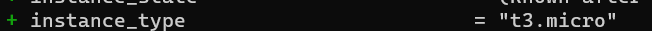
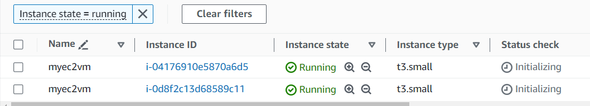
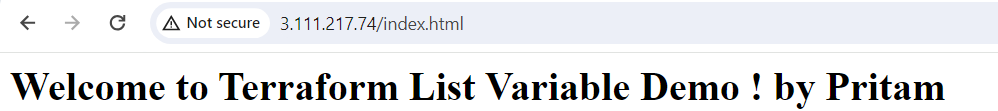
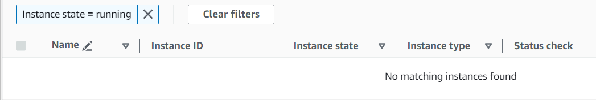

Thease are 2 variables we have in the variable.tf

variable "ec2_instance_count" {
  description = "EC2 Instance Count"
  type        = number
  default     = 2
}

variable "ec2_instance_type" {
  description = "EC2 Instance Type"
  type = list(string)
  default = ["t3.micro", "t3.small", "t3.large"]
}

And in the main file we passed :  instance_type = var.ec2_instance_type[0]

That means 2 EC2 will be created with t3.micro instance_type
terraform init

terraform validate

terraform plan

If we need to change the type to t3.small 

now, terraform apply --auto-approve

terraform destroy --auto-approve

