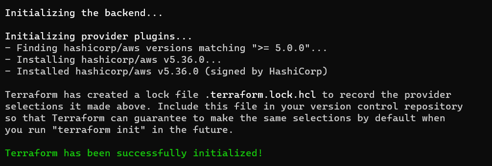

We are going to implement Map input Variable in Terraform

This is one map input variable present in the variable.tf file

variable "ec2_instance_tags" {
  description = "EC2 Instance Tags"
  type = map(string)
  default = {
    "Name" = "ec2-web"
    "Tier" = "Web"
  }
}

Here we are tagging our EC2 instances with the Name 'EC2-web' and the Tier 'web'

And we have another map variable

variable "ec2_instance_type_map" {
  description = "EC2 Instance Type"
  type = map(string)
  default = {
    "dev" = "t3.micro"
    "pre-prod" = "t3.medium" 
    "prod" = "t3.large"    
  }
}

Here we have 3 MAP inputs and we can call the desired input from the main.tf file like this 

instance_type = var.ec2_instance_type_map["pre-prod"]

Lets test this 

terraform init

terraform validate

terraform plan

Now, if we want to create server for dev environment then we need to change the main.tf file like this

 instance_type = var.ec2_instance_type_map["dev"]

 Again do terraform plan

 

 terraform apply --auto-approve

 

 

 terraform destroy --auto-approve

 