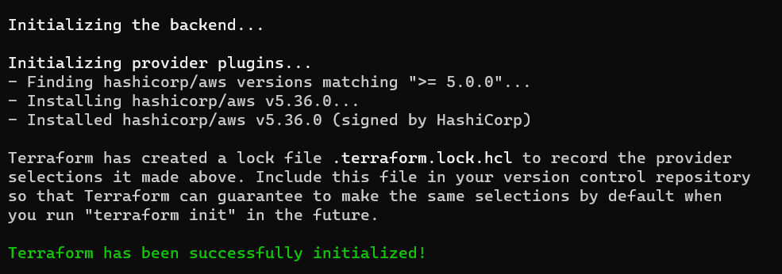
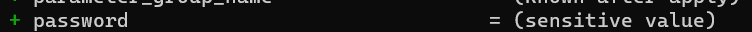
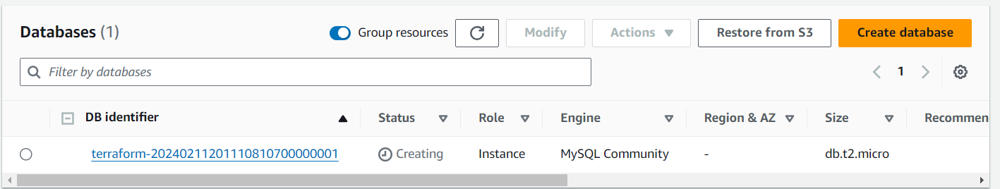
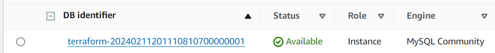
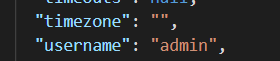
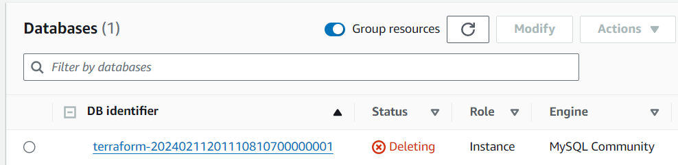
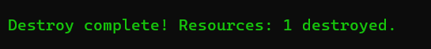
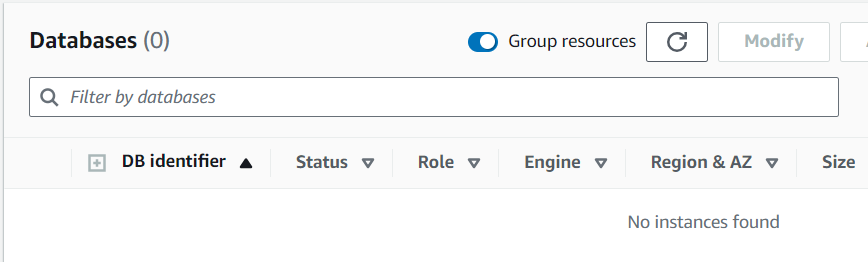

terraform init

terraform validate

terraform plan -var-file f3-secrets.tfvars

>terraform apply --auto-approve -var-file f3-secrets.tfvars

Note : 

1) Never Push secret.tfvar file in GIT HUB (For this demo I am pughing but in realtime we should not push the same)

2) The secrets will be exposed into the .tfstate file and hence state file also should not be pushed in GIT

In the .tfstate file we can see this data

terraform destroy --auto-approve

terraform destroy --auto-approve -var-file=f3-secrets.tfvars

